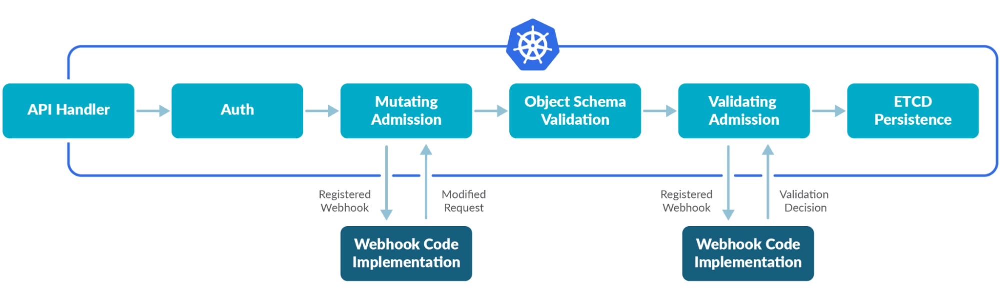
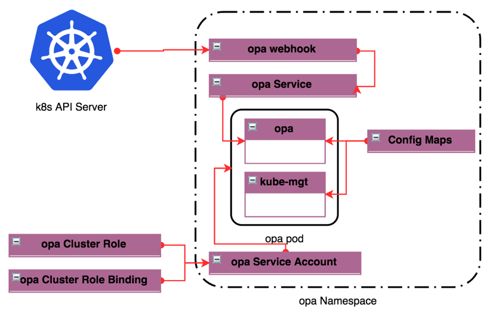

# Webhooks

A WebHook is an HTTP callback: an HTTP POST that occurs when something happens; a simple event-notification via HTTP POST. A web application implementing WebHooks will POST a message to a URL when certain things happen.

#### Types of Admission Webhooks: 
* Mutating admission webhook
* Validating admission webhook

### Admission-controller Tasks
#### Research Task
   1) sub-task-1: Deploy, interact and walk through the  [Production Ready Examples](https://github.com/slok/k8s-webhook-example) : Duration 2 wroking days
   2) sub-task-2: Try out [OPA-SDK](https://github.com/open-policy-agent/example-api-authz-go) : Duration 1 working day
   3) sub-task-3: Try out OPA-services : Duration 1 working day
   

#### Implementation Task
1) sub-task-1: Admission Controller Implemention  Deployment and Testing: 2 working days
2) sub-task-2: OPA : Implemention and Testing: 2 working days
3) sub-task-3: Documentation and bug-fixes: 2 working days

  ##### Total Time Frame: 10 working days!
